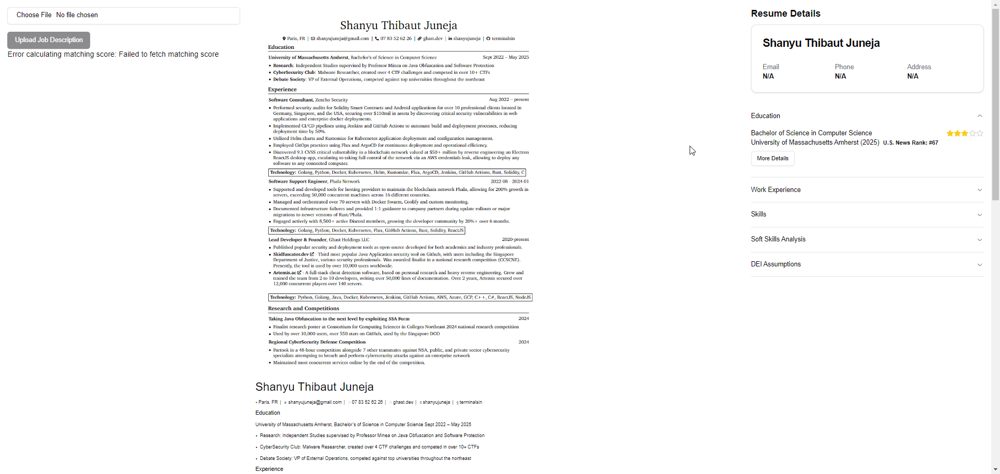

<div align="center">
  
</div>

# Resume ~~Hater~~ Polite Analysis Tool 

Resume Rater is a Next.js application that analyzes resumes using AI, provides detailed insights, and matches them against job descriptions.

## Preview



## Features

- Resume analysis using GPT-4
- PDF viewer for uploaded resumes
- Detailed breakdown of resume components (education, work experience, skills)
- Soft skills analysis
- DEI (Diversity, Equity, and Inclusion) assumptions
- Job description matching
- University ranking information

## Planned Features
- Social media scraping and analysis
- LinkedIn profile analysis
- Resume scoring
- Job matching

## Getting Started

### Prerequisites

- Node.js (version 14 or later)
- npm or yarn

### Installation

1. Clone the repository:
   ```
   git clone https://github.com/your-username/resume-rater.git
   cd resume-rater
   ```

2. Install dependencies:
   ```
   npm install
   ```

3. Set up environment variables:
   Create a `.env.local` file in the root directory and add the following:
   ```
   OPENAI_API_KEY=your_openai_api_key
   ```

4. Run the development server:
   ```
   npm run dev
   ```

5. Open [http://localhost:3000](http://localhost:3000) with your browser to see the result.

## Project Structure

- `src/app`: Next.js app router pages
- `src/components`: React components
- `src/hooks`: Custom React hooks
- `src/lib`: Utility functions and configurations
- `src/services`: API service functions
- `src/types`: TypeScript type definitions

## Database

The project uses Drizzle ORM with LibSQL (Turso) as the database. To update the database schema, run:

```
npm run db:push
```

## Deployment

The easiest way to deploy your Next.js app is to use the [Vercel Platform](https://vercel.com/new?utm_medium=default-template&filter=next.js&utm_source=create-next-app&utm_campaign=create-next-app-readme) from the creators of Next.js.

Check out the [Next.js deployment documentation](https://nextjs.org/docs/app/building-your-application/deploying) for more details.

## Contributing

Contributions are welcome! Please feel free to submit a Pull Request.

## License

This project is licensed under the ?? License.